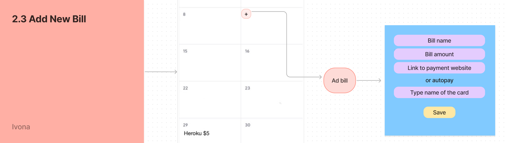
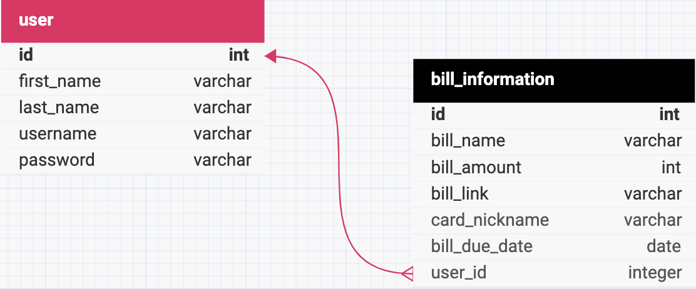

# Solo_Project_Scope

# BillTracker

Radenovic Ivona

July 30 2024

# Application Overview

BillTracker allows users to see expenses that occur each month. Some of them may be car insurance, healthcare coverage, dental insurance, streaming services, cellular services, rent, credit card payments etc. Instead of remembering all bills due a month the user can use this application as note taking for bills .   
To help relieve stress BillTracker allows users to take a look at their upcoming bills and plan their finances accordingly.

# Functional Requirements

### 1.0 Log-in and Register (desktop)

Background of the log-in and register page is an example of the look of the app to attract users to register. Having a register window on the page makes it easier to register. Register window consists of fields with first name, last name, email and password. For existing users we have the sign in window that requires email and password.

### 2.0 Home page (calendar view)

Home page will have the monthly calendar view upon opening. Top right corner will be navigation. Users will have the overview of their bills and have an option to click any bill and view its information. When hovering over the number of a date an option ‘+’ will appear that will allow users to add a new bill.

### 2.1 Navigation

The user can switch views from monthly to weekly on every page. As well as the users initials will be accessible on and page and upon clicking will give an option to log out.  

### 2.2 Bill View

Users are able to click on a bill and open its information in a pop up window. Bill view displays name, amount, due date payment information. The “Delete” button allows users to delete the entire bill. Once clicked the “Edit” button replaced the bill view pop up. On edit pop up users can edit all the bill information and save it.

### 2.3 Add Bill

When users hover over a date’s number an option “+” to add a new bill appears. Once clicked it opens a pop up form with fields for the bill’s information. Basic information is the bill’s name and amount. The optional is payment information. Users can paste a link to their bill’s payment information for easier future allocation of the page, or they can put a name of the card they are using and that way they know where the money will be taken from. After the “Save” button is clicked the pop up form closes and bill appears on the date added. Users get to stay on the monthly view page at all times.

# 3rd Party API

Stretch: Google Calendar API

# Project Schedule

| Feature | Date | Base or Stretch Goal |
| ----- | ----- | ----- |
| Create database | August 5th | Base |
| Find calendar UI design | August 6th | Base |
| Log in | August 11th | Base |
| Register | August 13th | Base |
| Calendar background on login page | August 14th | Base |
| Add bill  | August 18th | Base |
| Calendar API | August 27th | Stretch |

# Database Structure

Used [https://dbdesigner.net/](https://dbdesigner.net/) for the diagram

# Browsers

Application will fully support browsers listed below. All browsers or versions not listed below are considered out of scope.

| Browser Name | Version |
| :---- | :---- |
| Microsoft Edge | 127 |

# Technologies

* Node.js
* JavaScript
* Express
* React
* PostgreSQL
* Git
* Heroku

\*prone to change\*  
